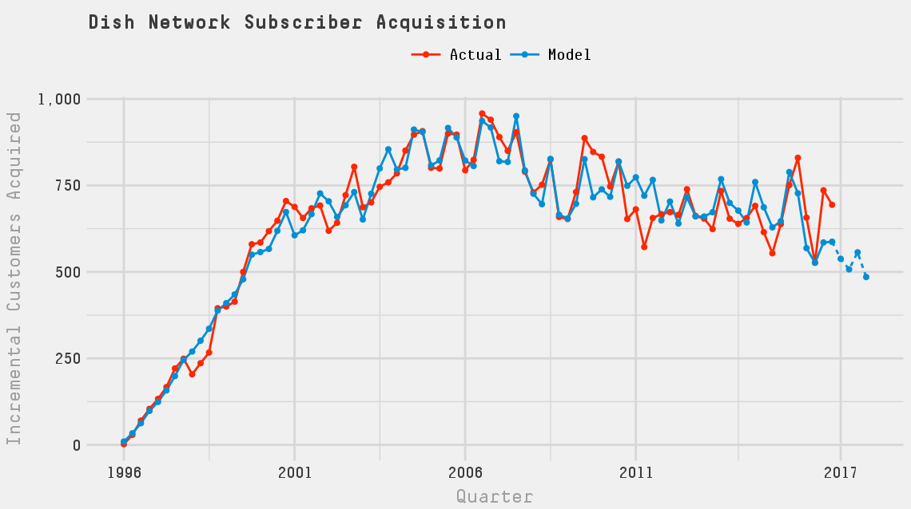

# MKTG776 Project 2
Implement timing model that will predict Dish Network’s subscriber acquisition in 2017

# Executive Summary
In this analysis we attempt to identify and implement a timing model that will best predict Dish Network's subscriber acquisition in 2017. Our starting dataset is quarterly subscriber acquisition from 1996 to 2016. Using a Weibull distribution to explain a customer's time to subscribe we attempt to account for heterogeneity with segments (finite-mixture models), including hard-core never-acquirers, and a continuous Gamma distribution. We find that a Weibull-Gamma model performs well but alone is insufficient to explain Dish Network's customer acquisition. By adding covariates that describe macroeconomic trends, consumer sentiment, seasonality, and the competitor Netflix's performance, we improve our explanation of Dish' Network's customer acquisition. The plot below presents Dish's actual incremental subscriber acquisition by quarter and our model and forecast (dashed) for 2017.
