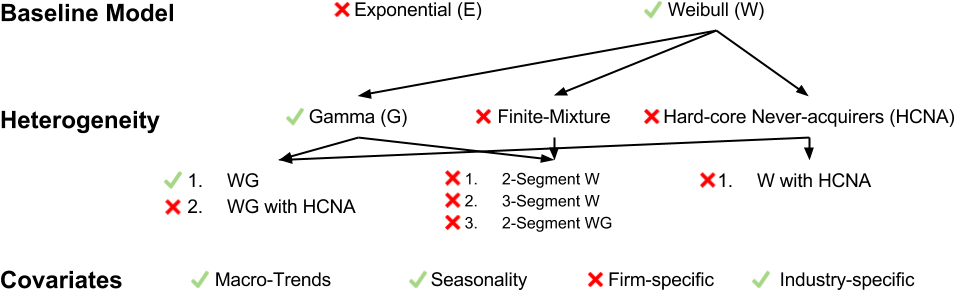

```{r setup, include = FALSE}
knitr::opts_chunk$set(echo = FALSE, message = FALSE, warning = FALSE, fig.align = 'center', size = 'small', fig.pos = 'H',
                      fig.width = 6, fig.height = 3.5)

knitr::knit_hooks$set(
          size = function(before, options, envir) {
                  if (before) return(paste0("\n \\", options$size, "\n\n"))
                  else return("\n\n \\normalsize \n")
                  }
          , inline = function(x) {if(!is.numeric(x)){ x }else{ prettyNum(round(x,2), big.mark=",") } }
          )
```

```{r report-load-packages, results = 'hide', include = FALSE}
pacman::p_load(tidyverse, forcats, pander, stringr, lubridate, jrfTools, extrafont, RcppRoll, ggrepel, tm, pdftools, tidyquant)
```

```{r report-additional-setup, include = FALSE}
options(scipen=999)
panderOptions('digits', 8)
panderOptions('round', 4)
panderOptions('keep.trailing.zeros', TRUE)
panderOptions('big.mark', ',')

model_dir <- "model_dir/"
viz_dir <- "viz/"
```

```{r report-wordcount}
fn_cound_words <- function(file) {
  txt <- pdf_text(file)
  corp1 <- VCorpus(VectorSource(txt))
  corp2 <- tm_map(corp1, stripWhitespace)
  corp3 <- tm_map(corp2, removePunctuation)
  corp4 <- tm_map(corp3, content_transformer(tolower))
  corp5 <- tm_map(corp4, removeNumbers)
  dtm <- TermDocumentMatrix(corp5)
  dtm %>% as.matrix() %>% sum()
}

if (file.exists(paste0("mktg776_p2.pdf"))) {
 n_words <- fn_cound_words(paste0("mktg776_p2.pdf")) 
} else {
  n_words <- 0
}
```

```{r load_dish_dataset}
dish <- read_csv("dish_data.csv") %>%
  mutate(quarter_date = yq(quarter))
```

```{r time_series_plot}
dish %>%
  ggplot(aes(x = quarter_date, y = customers_acquired)) +
  geom_line(colour = pal538[['blue']]) +
  geom_point(colour = pal538[['blue']], size = 1) +
  theme_jrf(users_v = "rstudio") +
  labs(title = "Dish Network Subscriber Acquisition", y = "Customers Acquired", x = "Quarter") +
  scale_y_continuous(labels = scales::comma)
```

```{r fn_negate}
fn_negate <- function(x) {
  if (x == Inf) {
    return(-Inf)
  } else if (x == -Inf) {
    return (Inf)
  } else {
    return(-x)
  }
}
```

```{r fn_create_covariate_df}
fn_create_covariate_df <- function(data, input_cov_names, cov_betas) {
  
  if (!is.null(input_cov_names)) {
    
    #Check that number of betas matches number of cov_names
    if (length(cov_betas) != length(input_cov_names)) {
      stop("Number of betas does not match number of cov_names")
    }
  
    data2 <- 
      data %>%
      mutate(isCov = TRUE) %>%
      unite(cov_char, one_of(input_cov_names), sep = ",", remove = FALSE) %>%
      mutate(
        cov_char_split = stringr::str_split(cov_char, ",")
        , covs = map(cov_char_split, as.numeric)
      ) %>%
      select(-cov_char, -cov_char_split)
      
  } else {
    data2 <- data %>% mutate(isCov = FALSE, covs = NA)
  }
  return(data2)
}
```

```{r fn_PT_less_t}
fn_PT_less_t <- function(Bt_cum, Bt_instant, isCov, r, alpha, heterogeneity) {
  
  if (heterogeneity == "gamma") {
    if (isCov) {
      PT_less_t <- 1 - (alpha / (alpha + Bt_cum))^r
    } else {
      PT_less_t <- 1 - (alpha / (alpha + Bt_instant))^r
    }
  } 
  
  return(PT_less_t)
}
```

```{r fn_data3}
fn_weibull_cov <- function(r, alpha, c, cov_betas, data2, cov_names, population, heterogeneity) {
  
  data3 <- 
    data2 %>%
    rowwise() %>%
    mutate(expBX  = if_else(isCov, exp(sum(cov_betas * covs)), 1.0)) %>%
    ungroup() %>%
    mutate(
      Bt_instant = (t^c - if_else(isCov, lag(t, default = 0)^c, 0)) * expBX
      , Bt_cum = cumsum(Bt_instant)
    ) %>%
    rowwise() %>%
    mutate(
      PT_less_t = map2_dbl(Bt_cum, Bt_instant, fn_PT_less_t, isCov, r, alpha, heterogeneity)
    ) %>%
    ungroup() %>%
    mutate(
       PT_t = PT_less_t - lag(PT_less_t, default = 0)
      , ll = x * log(PT_t)
    )
  
  return(data3)
}
  
```

```{r fn_wg_cov_ll}
fn_wg_cov_ll <- function(starting_values, data, cov_names, population, heterogeneity) {
  
  # Parameter Declaration
  r <- starting_values[1]
  alpha <- starting_values[2] 
  c <- starting_values[3];
  cov_betas <- starting_values[-c(1:3)]
  
  data2 <- fn_create_covariate_df(data, cov_names, cov_betas)
  
  data3 <- fn_weibull_cov(r, alpha, c, cov_betas, data2, cov_names, population, heterogeneity)
  
  last_ll <- (population - sum(data3$x)) * log(1 - tail(data3$PT_less_t, 1))
  ll <- sum(c(data3$ll, last_ll), na.rm = TRUE)

  neg_ll <- fn_negate(ll)
  return(neg_ll)
}
```

```{r fn_wg_cov_model}
fn_wg_cov_model <- function(model, data, cov_names, population, heterogeneity = c("gamma", "latent","2-segment gamma"), trace = FALSE) {
  
  if (!is.null(cov_names)) {
    cov_pars <- length(cov_names)
    init_par <- list(start =c(c(10, 10000, 1), rep(0.01, cov_pars)), lower = c(rep(0, 3), rep(-Inf, cov_pars)), 
                     upper = c(Inf, Inf, Inf, rep(Inf, cov_pars)))
  } else {
    cov_pars <- 0
    init_par <- list(start = rep(1, 3), lower = rep(0, 3), upper = rep(Inf, 3))
  }
  
  last_ll <- Inf 
  next_ll <- 1e10
  starting_values <- init_par$start
  while (next_ll < last_ll) {
    last_ll <- next_ll
    pars <- 
      nlminb(starting_values, fn_wg_cov_ll, lower = init_par$lower, upper = init_par$upper, 
                 data = data, cov_names = cov_names, population = population, heterogeneity = heterogeneity, 
                 control = list(eval.max = 500, iter.max = 500, x.tol = 1e-20,  trace = trace, 
                                abs.tol = 1e-20, rel.tol = 1e-15, x.tol = 1e-20,  xf.tol = 1e-20,
                                step.min = 1, step.max = 1, sing.tol = 1e-20))
    next_ll <- pars$objective
    starting_values <- pars$par
  }
  
  return(
    data_frame(model = model, r = pars$par[1], alpha = pars$par[2], c = pars$par[3], 
               cov_names = list(cov_names), cov_betas = list(pars$par[-c(1:3)]), params = (3 + cov_pars),
               population = population, heterogeneity = heterogeneity, ll = pars$objective)
  )
}
```

```{r kb_test_data, eval = FALSE}
data_raw <- readxl::read_excel("KB covariate models.xlsx", skip = 3)
kb_data <- data_raw %>%
  rename(t = Week, x = `# HHs`) %>%
  mutate(x = x - lag(x, default = 0)) %>%
  filter(t <= 24)

fn_wg_cov_model("Test", data = kb_data, cov_names = NULL, population = 1499, heterogeneity = "gamma", trace = T)
fn_wg_cov_model("Test", kb_data, cov_names = c("Coupon", "AnyP"), population = 1499)
```

```{r downlaod_fred_metrics}
fred_metrics <-
  c("UMCSENT", "CANDH") %>% 
  tq_get(get = "economic.data", from = "1996-01-01")

scale_this <- function(x) as.vector(scale(x))
  
fred_metrics2 <-
  fred_metrics %>%
  mutate(
    quarter = quarter(date, with_year = TRUE)
    , quarter_date = yq(quarter)
  ) %>%
  group_by(symbol, quarter_date, quarter) %>%
  summarise(price = mean(price)) %>%
  group_by(symbol) %>%
  mutate(scaled_value = scale_this(price)) %>%
  ungroup() %>%
  select(quarter_date, quarter, symbol, scaled_value) %>%
  spread(symbol, scaled_value)
```

```{r plot_fred_metrics}
fred_metrics2 %>%
  gather(metric, value, -quarter_date, -quarter) %>%
  ggplot(aes(x = quarter_date, y = value, colour = metric)) +
  geom_line() + geom_point()
```

```{r seasonality}
ts_customers_acquired <- ts(dish$customers_acquired, frequency = 4)
decompose_acquisition <- stl(ts_customers_acquired, s.window = 7)

seasonality_df <- 
  decompose_acquisition$time.series %>% as.data.frame %>% as_tibble()

seasonality <- 
  data_frame(
    quarter_date = seq.Date(from = as.Date("1996-01-01"), to = as.Date("2016-12-31"), by = "quarter")
    , seasonality = scale_this(seasonality_df$seasonal)
  )

dish %>%
  bind_cols(seasonality_df) %>%
  select(quarter_date, actual = customers_acquired, seasonal, trend, remainder) %>%
  gather(type, value, -quarter_date) %>%
  mutate(type = factor(type, levels = c('actual', 'seasonal', 'trend', 'remainder'))) %>%
  ggplot(aes(x = quarter_date, y = value)) +
  facet_wrap(~type, ncol = 1, scales = 'free_y') +
  geom_line() +
  theme_jrf(users_v = "rstudio")
```

```{r slingbox_effect}
slingbox_effect <-
  data_frame(
    quarter_date = seq.Date(from = as.Date("1996-01-01"), to = as.Date("2016-12-31"), by = "quarter")
    , slingbox_effect = c(rep(0, 84-4-4), .1, .4, .8, 1, rep(0, 4))
  )
```

```{r netflix_stock}
netflix_financials <- tq_get("NFLX", get = "stock.prices", from = "1996-01-01")

netflix_stock <- 
  data_frame(
    quarter_date = seq.Date(from = as.Date("1996-01-01"), to = as.Date("2016-12-31"), by = "quarter")
  ) %>%
    left_join(
      netflix_financials %>%
        select(date, adjusted) %>%
        mutate(quarter_date = floor_date(date, unit = "quarter")) %>%
        group_by(quarter_date) %>%
        summarise(netflix_stock = mean(adjusted, na.rm = TRUE)) %>%
        ungroup() %>%
        mutate(netflix_stock = scale_this(netflix_stock)) 
      , by = "quarter_date"
    ) %>%
    replace_na(list(netflix_stock = 0))
```

```{r add_covariates_to_dish_data}
dish_model_data <-
  dish %>%
  select(-quarter) %>%
  left_join(fred_metrics2, by = c("quarter_date")) %>%
  left_join(seasonality, by = c("quarter_date")) %>%
  left_join(slingbox_effect, by = c("quarter_date")) %>%
  left_join(netflix_stock, by = c("quarter_date")) %>%
  rename(t = observation, x = customers_acquired)
```

```{r create_and_save_models, eval = FALSE}
covariates <- 
  dish_model_data %>%
    select(-t, -x, -quarter_date, -quarter) %>%
    names()

cov_list <- list()
for (i in 0:length(covariates)) {
  cov_list <- append(cov_list, combn(covariates, i, simplify = FALSE))
}

# Change string to detect to modify only certain models
cov_list_limited <- cov_list[str_detect(cov_list, ".")]
for (j in 1:length(cov_list_limited)) {
  if (length(cov_list_limited[[j]]) == 0) {
    model_name <- "No Covariates"
    model_filename <- "no_covs"
    cov_names <- NULL
  } else { 
    model_name <- paste0(cov_list_limited[[j]], collapse = " & ")
    model_filename <- paste0(cov_list_limited[[j]], collapse = "_")
    cov_names <- cov_list_limited[[j]]
  }
  
  tmp_df <- fn_wg_cov_model(model_name, dish_model_data, cov_names = cov_names, population = 60000, heterogeneity = "gamma")
  saveRDS(tmp_df, file = paste0(model_dir, model_filename, ".RDS"))
  
}
```

```{r load_all_models}
model_files <- list.files(path = model_dir, full.names = TRUE)
wg_cov_params <- lapply(model_files, readRDS) %>% bind_rows()
```

```{r results_by_quarter}
wg_cov_results <- 
  data_frame(quarter_date = seq.Date(from = as.Date("1996-01-01"), to = as.Date("2016-12-31"), by = "quarter")) %>%
  left_join(dish_model_data, by = c("quarter_date")) %>%
  crossing(model = wg_cov_params$model) %>%
  group_by(model) %>%
  nest() %>%
  left_join(wg_cov_params, by = "model") %>%
  mutate(data2 = pmap(list(data, cov_names,cov_betas), fn_create_covariate_df)) %>%
  mutate(data3 = pmap(list(r, alpha, c, cov_betas, data2, cov_names, population, heterogeneity), fn_weibull_cov)) %>%
  mutate(neg_ll = -1 * ll) %>%
  select(model, r, alpha, c, population, heterogeneity, params, neg_ll, data3) %>%
  unnest(data3) %>%
  mutate(
    expected_instant = population * PT_t
    , expected_cumulative = population * PT_less_t
    , ape = abs(expected_instant - x) / x
  ) %>%
  select(model, r, alpha, c, population, heterogeneity, params, neg_ll, ape, 
         quarter_date, t, expected_instant, expected_cumulative)
```

```{r model_level_summary}
wg_cov_summary <- 
  wg_cov_results %>% 
  group_by(model, params, neg_ll) %>%
  summarise(
      mdape = median(ape)
      , n_obs = n()
  )  %>%
  ungroup() %>%
  mutate(bic = -2 * neg_ll + params * log(n_obs)) %>%
  arrange(bic)
```


**Word Count**: `r n_words`

# Executive Summary


Forceast Plot

# Analysis

## Candidate Models




\begin{align}
\ P(T \le t) & = \int_{0}^{\infty} \Big(1 - e^{\lambda B(t)} \Big) \frac{\alpha^r \lambda^{r-1} e^{-\alpha \lambda}}{\Gamma(r)} d \lambda \\
 & = 1 - \Big( \frac{\alpha}{\alpha + B(t)}  \Big)^{r}
\end{align}

where

\begin{align}
\ B(t) = \sum_{i=1}^{t} \big( i^c - (i- 1)^c \big) e^{\boldsymbol{x}(i) \boldsymbol{\beta}}
\end{align}

## Covariates

-- Explain scaling

### Macro-Trends


### Seasonality


### Firm-specific


### Industry-specific


## WG + Covariates

```{r}
wg_cov_summary %>%
  top_n(10, desc(bic)) %>%
  select(
    Covariates = model
    , `# Params` = params
    , `LL` = neg_ll
    , `Median APE` = mdape
    , BIC = bic
  ) %>%
  pander(caption = "Top 10 Weibull-Gamma with Covariate Model by BIC", 
         round = c(0, 0, 0, 4, 0))
```

```{r instant_plot}
instant_plot_data <-
  dish %>%
  select(quarter_date, expected_instant = customers_acquired) %>%
  mutate(model = "Actual") %>%
  bind_rows(
    wg_cov_results %>%
      inner_join(
        wg_cov_summary %>% filter(model %in% c('CANDH & UMCSENT & seasonality & netflix_stock', 
                                               'UMCSENT & seasonality & netflix_stock'))
        , by = "model"
      ) %>%
      select(quarter_date, expected_instant, model) 
  )

ggplot(instant_plot_data) +
  geom_line(aes(x = quarter_date, y = expected_instant, colour = model)) +
  theme_jrf(users_v = "rstudio") +
  labs(title = "Incremental Customer Acquisitions", subtitle = "Top 2 Models", 
       x = "Quarter", y = "Customers Acquired", colour = NULL) +
  scale_y_continuous(labels = scales::comma) +
  scale_color_manual(values = c(pal538[['red']], pal538[['blue']], pal538[['green']]))
```

```{r cumulative_plot}
cumulative_plot_data <-
  dish %>%
  mutate(expected_cumulative = cumsum(customers_acquired)) %>%
  select(quarter_date, expected_cumulative) %>%
  mutate(model = "Actual") %>%
  bind_rows(
    wg_cov_results %>%
      inner_join(
        wg_cov_summary %>% filter(model %in% c('CANDH & UMCSENT & seasonality & netflix_stock', 
                                               'UMCSENT & seasonality & netflix_stock'))
        , by = "model"
      ) %>%
      select(quarter_date, expected_cumulative, model) 
  )

ggplot(cumulative_plot_data) +
  geom_line(aes(x = quarter_date, y = expected_cumulative, colour = model)) +
  theme_jrf(users_v = "rstudio") +
  labs(title = "Cumulative Customer Acquisitions", subtitle = "Top 2 Models", 
       x = "Quarter", y = "Cumulative Customers Acquired", colour = NULL) +
  scale_y_continuous(labels = scales::comma) +
  scale_color_manual(values = c(pal538[['red']], pal538[['blue']], pal538[['green']]))
```

# Results

## Final Model

### Forecast 2017


# Limitations

# Appendix

